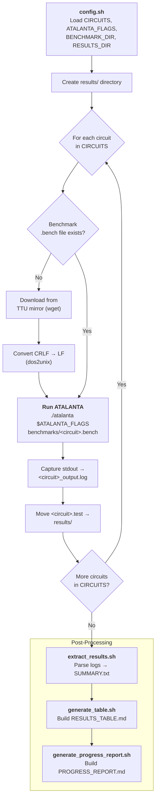

# ATALANTA Automated Experiment System - By Jasem Ali

**Quick Start:** `./run_experiments.sh`

## Documentation

- **User Manual:** `./help.sh manual` or `less USER_MANUAL.md`
- **Setup Guide:** `./help.sh setup` or `less SETUP_DOCUMENTATION.md`
- **ATALANTA Help:** `./help.sh atalanta` or `./atalanta -h a`
- **Quick Reference:** `./help.sh quick`

## Essential Commands

| Command                        | Purpose                  |
|--------------------------------|--------------------------|
| `./run_experiments.sh`         | Run all experiments      |
| `./clean.sh`                   | Clean results directory  |
| `nano config.sh`               | Edit configuration       |
| `cat results/RESULTS_TABLE.md` | View results             |
| `./help.sh`                    | View help system         |

## Project Structure
```
.
├── atalanta              # ATALANTA executable
├── benchmarks/           # Circuit files
├── results/              # Experimental results
├── config.sh             # Configuration
├── run_experiments.sh    # Main runner
├── help.sh               # Help system
└── *.md                  # Documentation
```



For detailed instructions, run: `./help.sh manual`
